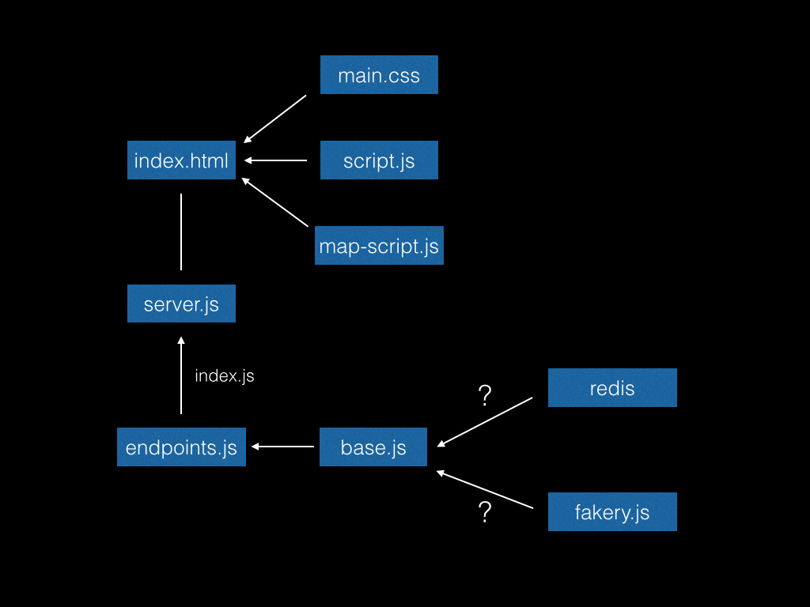

[](https://www.bithound.io/github/plastic-cup/quacker/master)  [](https://codeclimate.com/github/plastic-cup/quacker) <a href="https://codeclimate.com/github/plastic-cup/quacker/coverage"></a>  [](https://github.com/plastic-cup/quacker)

# Quacker
A NEW AND REVOLUTIONARY IDEA

## Why

To get rich! Also, as a side effect, to learn endpoint handling. We are going to keep our code modular and get experience routing requests to create a CR-D application.

We want to make an app that's good for publishing short thoughts and seeing other people's. Can't believe no one's thought of it yet.

## What

Quacker is a real-time micro-networking synergy facilitator and developer (but not creator!). Our dream is a world in which frictions in collaborative content-development and -management are ameliorated -- or even eliminated!

You can write a message in our box and send it and then it will show up on the map and you'll see it and so will everyone else looking at it.

  + [x] An app with Create, Read and Delete endpoints

  + [x] Quax will be persistently available

  + [x] Some authentication process
    + [x] Cookies

  + [x] LIVE on HEROKU! Quack.

  + [x] Real-time quack updates

  + [x] Location data


## How

### How to run & test it

We are currently not on a tight publishing schedule on NPM. Therefore, we suggest cloning this repo and running `npm install` in the directory to install all dependencies and dev-dependencies. To run the app, you will require a file named `.env` in the project directory, the Heroku toolbelt and redis. The `.env` file should contain the following:

```
REDISTOGO_URL = "http://:@127.0.0.1:6379/"
PORT = 8000
```

To run, make sure redis is running, then use `foreman start` on the command line. This is necessary to access the correct environment variables declared in the `.env` file.

You can then check us out on `localhost:8000`.

We have pretty good (but not complete) coverage with our tests. Have a look in our test file to see the guts. `npm test` to see the output.

We inject a fake connection into our code allowing us to test without redis running. We also create fake requests and response using the default readable stream from node.

### A map of our application structure



### A brief overview of our methods

Using the built-in API of most browsers, we query the user for their location. This is then translated into a url that we parse on the server-side to create an object that we then stringify and store in redis. 
